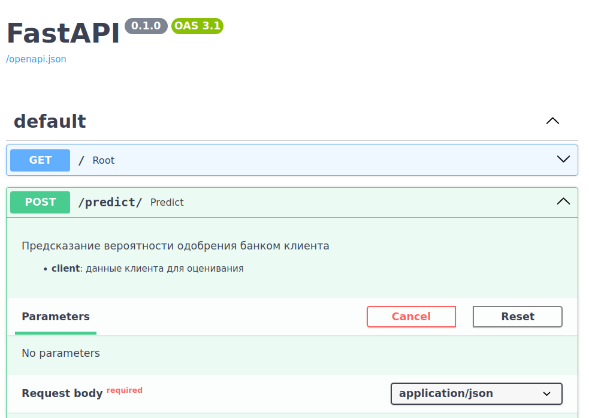
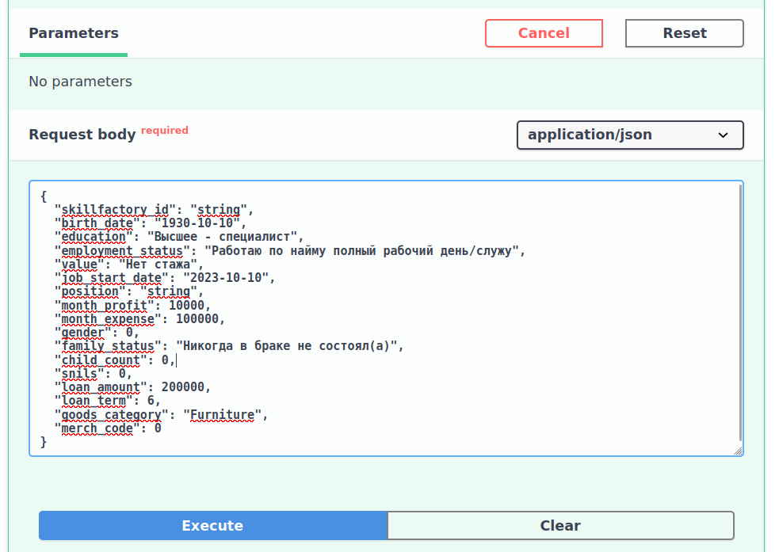
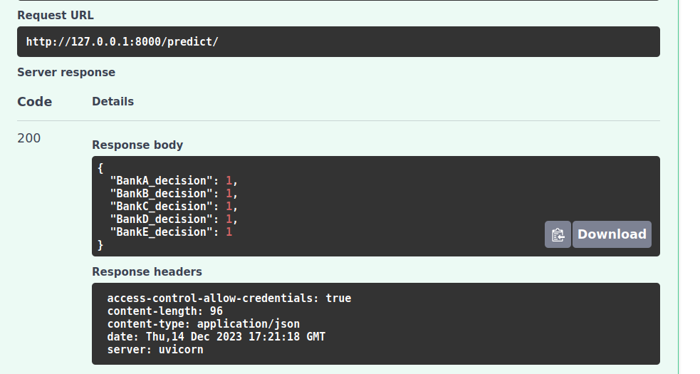
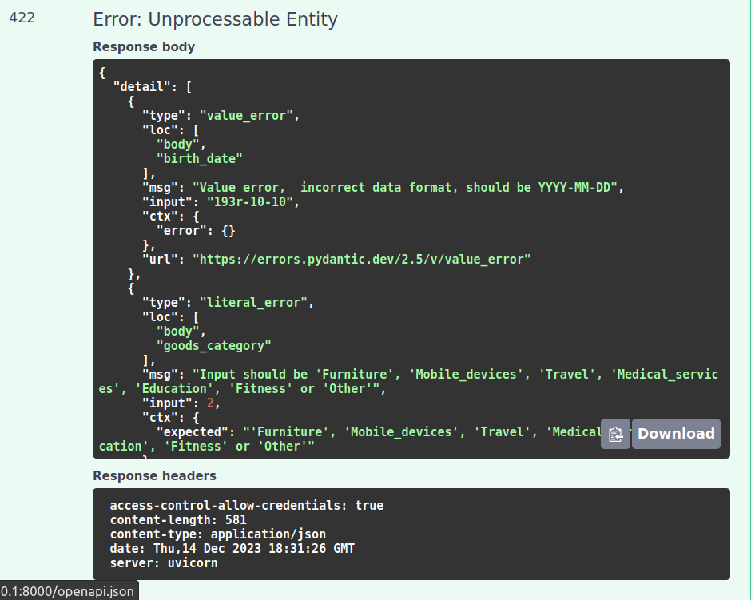

# Хакатон: задача от Mandarin 

## Группа 4

Состав группы:

- Dmitrii-Krasnov: Дмитрий Краснов
- svwk: Светлана Савоськина
- GLOBB1000: Артем Солодухин
- AFK0: Витченко Сергей

## Описание проекта

Оценка возможности одобрения кредита банками заданному клиенту

В решении используется модель дерева решений библиотеки XGBoost XGBClassifier https://xgboost.readthedocs.io/en/stable/

XGBoost (eXtreme gradient boosting) - известный и мощный инструмент машинного обучения, 
обычно используемый для задач контролируемого обучения, таких как классификация, регрессия и ранжирование.
Он построен на архитектуре gradient boosting и приобрел популярность благодаря своей высокой точности и масштабируемости.

## Использованные технологии

- pandas>=2.1.3
- scikit-learn>=1.3.0
- pyyaml>=6.0.0
- python-dateutil>=2.8.2
- numpy>=1.26.0
- joblib~=1.3.2
- xgboost~=2.0.2
- dvc>=3.30.3
- fastapi>=0.95.1
- uvicorn>=0.21.1
- pydantic>=2.5.0

## Установка

- Для установки зависимостей для сервера, выполните команду:

  `pip install -r requirements.txt`

## Использование

- Для запуска выполните:

`uvicorn api:app --reload`

- Для работы с приложением перейдите по ссылке:
  http://127.0.0.1:8000/docs

- Откроется окно swagger, в котором есть два роута (метода):
    - Роут "/" покажет описание проекта.
    - Роут "/predict" предсказывает одобрения банками заявки клиента.

- Список ограничений на данные клиента
  - **birth_date**: дата формата YYYY-MM-DD 
  - **education**: "Высшее - специалист", "Среднее профессиональное", "Среднее", "Неоконченное высшее", "Бакалавр", "Несколько высших", "Магистр", "Неоконченное среднее", "MBA", "Ученая степень"
  - **employment_status**: "Работаю по найму полный рабочий день/служу", "Собственное дело", "Не работаю", "Работаю по найму неполный рабочий день", "Студент", "Декретный отпуск", "Пенсионер"
  - **value**: "10 и более лет", "3 - 4 года", "2 - 3 года", "4 - 5 лет", "5 - 6 лет", "1 - 2 года", "6 - 7 лет", "7 - 8 лет", "8 - 9 лет", "6 месяцев - 1 год", "9 - 10 лет", "Нет стажа", "4 - 6 месяцев", "менее 4 месяцев"
  - **job_start_date**: дата формата YYYY-MM-DD
  - **month_profit**: положительное число
  - **month_expense**: положительное число
  - **gender**: 0 или 1
  - **family_status**: "Никогда в браке не состоял(а)", "Женат / замужем", "Разведён / Разведена", "Гражданский брак / совместное проживание", "Вдовец / вдова"
  - **child_count**: целое неотрицвтельное число
  - **snils**: 0 или 1
  - **loan_amount**: положительное число
  - **loan_term**: 6, 12, 18 или 24
  - **goods_category**: "Furniture", "Mobile_devices", "Travel", "Medical_services", "Education", "Fitness", "Other"
  - **merch_code**: целое число от 1 до 90

## Пример использования

- Пример тестовых данных:
```json
{
  "skillfactory_id": "string",
  "birth_date": "2002-01-01",
  "education": "Высшее - специалист",
  "employment_status": "Работаю по найму полный рабочий день/служу",
  "value": "Нет стажа",
  "job_start_date": "2022-01-01",
  "position": "string",
  "month_profit": 1,
  "month_expense": 900,
  "gender": 0,
  "family_status": "Никогда в браке не состоял(а)",
  "child_count": 5,
  "snils": 0,
  "loan_amount": 10000,
  "loan_term": 6,
  "goods_category": "Furniture",
  "merch_code": 2
}
```
- Запрос


- Успешный ответ

- Неуспешный ответ
